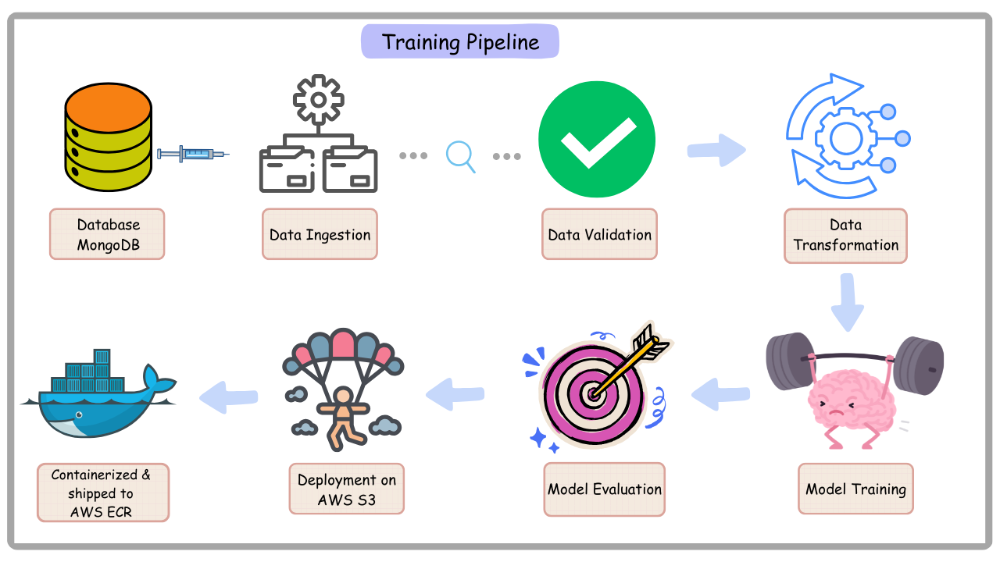
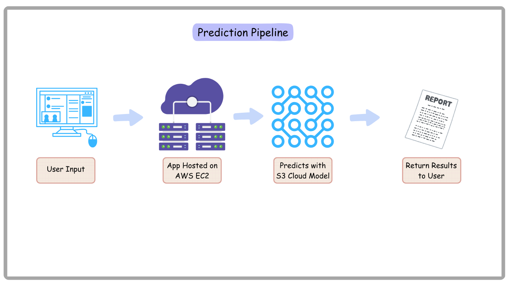

# 🎯 Ad Click Prediction MLOps Project

A robust end-to-end MLOps project that predicts whether a user will click on an advertisement based on various user behavioral and demographic features.

## Training Pipeline Structure


## Prediction Pipeline Structure


## 🌟 Project Overview

This project implements a complete MLOps pipeline for ad click prediction, incorporating best practices in machine learning operations including automated data pipelines, data ingestion, data validation, data transforamtion, model training, evaluation, and deployment. The system uses MongoDB for data storage, AWS for model registry and deployment, Data Version Control and Performance tracking, and includes comprehensive CI/CD pipelines.

### 🎲 Features Used for Prediction
- Age
- Gender
- Device Type
- Ad Position
- Browsing History
- Time of Day

## 🏗️ Project Architecture

The project follows a modular and scalable architecture with the following components:

1. **Data Ingestion** 📥
   - MongoDB integration for data storage and retrieval
   - Automated data extraction and transformation pipeline
   - Data validation and quality checks

2. **Data Validation** ✅
   - Schema validation using YAML configuration
   - Data drift detection
   - Automated validation reports

3. **Data Transformation** 🔄
   - Feature engineering pipeline
   - Data preprocessing and standardization
   - Automated transformation artifacts

4. **Model Training** 🧠
   - Automated model training pipeline
   - Hyperparameter optimization
   - Model performance logging

5. **Model Evaluation** 📊
   - Automated performance metrics calculation
   - Model comparison with existing production model
   - AWS S3 integration for model registry

6. **Model Deployment** 🚀
   - Containerized deployment using Docker
   - AWS ECR for container registry
   - CI/CD pipeline using GitHub Actions

## 🛠️ Tech Stack

- **Python 3.10**
- **MongoDB Atlas** - Data Storage
- **AWS Services**:
  - S3 (Model Registry)
  - ECR (Container Registry)
  - EC2 (Deployment)
- **Docker** - Containerization
- **GitHub Actions** - CI/CD Pipeline
- **FastAPI** - Web Application

## 🚀 Getting Started

1. Clone the repository:
```bash
git clone https://github.com/bobinsingh/Ad-Click-Prediction-MLOps.git
```

2. Create and activate a conda environment:
```bash
conda create -n Ad python=3.10 -y
conda activate Ad
```

3. Install requirements:
```bash
pip install -r requirements.txt
```

4. Set up MongoDB connection:
```bash
export MONGODB_URL="your_mongodb_connection_string"
```

5. Set up AWS credentials:
```bash
export AWS_ACCESS_KEY_ID="your_access_key"
export AWS_SECRET_ACCESS_KEY="your_secret_key"
```

## 💻 Project Structure

```
├── artifacts/               # Training artifacts and model files
├── dataset/               # Contains a local copy of dataset used in this project
├── configs/                 # Contain Schema and Model config files
├── src/
│   ├── components/         # Core pipeline components
│   ├── configuration/      # Configuration utilities
│   ├── entity/            # Entity definitions
│   ├── exception/         # Custom exception handling
│   ├── logger/           # Logging configuration
│   └── utils/            # Utility functions
├── static/                # Static files for web application
├── templates/             # HTML templates
├── app.py                # FastAPI application
├── Dockerfile            # Docker configuration
├── requirements.txt      # Project dependencies
└── setup.py             # Project setup configuration
```

## 🔄 MLOps Pipeline

1. **Data Pipeline**:
   - Automated data ingestion from MongoDB
   - Data validation and quality checks
   - Feature engineering and transformation

2. **Training Pipeline**:
   - Model training with latest data
   - Performance evaluation
   - Model versioning and registry

3. **Deployment Pipeline**:
   - Automated Docker image creation
   - Push to AWS ECR
   - Deployment to EC2 instance

## 🌐 Web Application

The project includes a web interface for:
- Real-time ad click predictions
- Model training triggering
- Performance monitoring

## 🤝 Contributing

Contributions are welcome! Please feel free to submit a Pull Request.

## 📝 License

This project is licensed under the MIT License - see the LICENSE file for details.